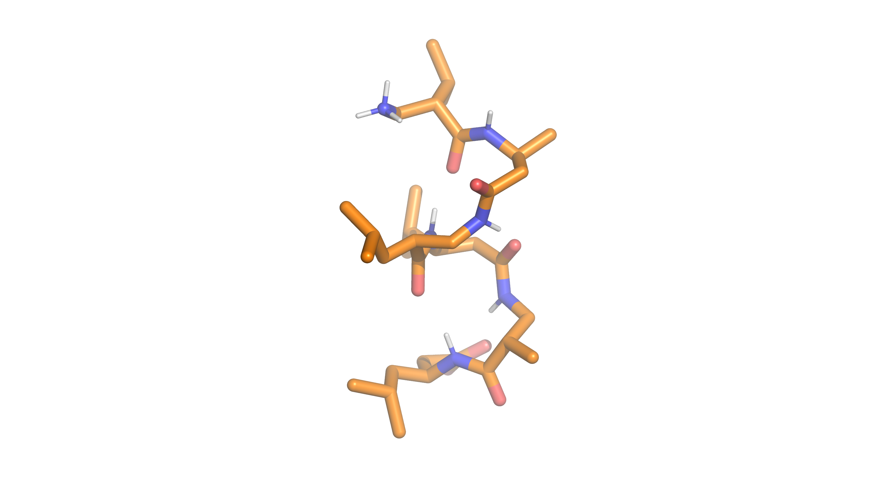

#  Insights into the Dynamics of Peptide Alpha Helix Formation
## Physical Chemistry Practicum - Molecular Dynamics Simulations

This teaching project is used for the Physical Chemistry Practicum with the topic Molecular Dynamics (MD) Simulations for pharmacy and biology students.
Here fundamentals of the analysis of MD simulations will be taught, like:
 * H-Bond analysis
 * structural RMSD analysis
 * Free Energy Calculation
 * Torsional Angle Distribution analysis 
 * Butina Clustering 
 * NOE - Analysis

 Additional content of the teaching unit can be found in the literature folder:
 * Introduction to MD
 * Introduction to the biologic Question: Insights into peptide alpha-Helix formation
 * How to visualize a molecule

## Useage

    Comming soon

## Authors
Carmen Esposito
Benjamin Ries
Marina Oliveria
Sadra Kashef Ol Gheta
